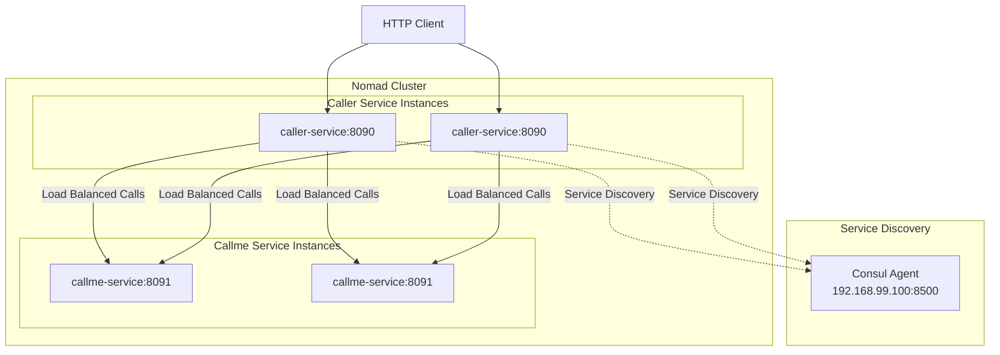

# Sample Nomad Java Services [](https://twitter.com/piotr_minkowski)

[](https://circleci.com/gh/piomin/sample-nomad-java-services)  
[](https://sonarcloud.io/dashboard?id=piomin_sample-nomad-java-services)  
[](https://sonarcloud.io/dashboard?id=piomin_sample-nomad-java-services)  
[](https://sonarcloud.io/dashboard?id=piomin_sample-nomad-java-services)  
[](https://sonarcloud.io/dashboard?id=piomin_sample-nomad-java-services)

A demonstration project showing how to deploy Spring Cloud microservices on HashiCorp's Nomad orchestrator with Consul service discovery.

## 📖 Detailed Description

For a comprehensive guide, visit: [Deploying Spring Cloud Microservices on Hashicorp's Nomad](https://piotrminkowski.com/2018/04/17/deploying-spring-cloud-microservices-on-hashicorps-nomad/)

## 🏗️ Architecture Overview

This project demonstrates a microservices architecture using Spring Cloud components deployed on Nomad:



### Services Description

#### 🔗 caller-service
- **Purpose**: Demonstrates service-to-service communication and load balancing  
- **Technology Stack**: Spring Boot, Spring Cloud Consul Discovery, RestTemplate  
- **Port**: 8090 (configurable via `NOMAD_HOST_PORT_http`)  
- **Functionality**:
  - Exposes `/caller/ping` endpoint  
  - Makes load-balanced calls to `callme-service`  
  - Uses Consul for service discovery  
  - Returns combined response with build information  

#### 📞 callme-service
- **Purpose**: Simple REST service that responds to calls  
- **Technology Stack**: Spring Boot Web  
- **Port**: 8091 (configurable via `NOMAD_HOST_PORT_http`)  
- **Functionality**:
  - Exposes `/callme/ping` endpoint  
  - Returns service name and version information  
  - Lightweight service for demonstration purposes  

## 🛠️ Technology Stack

- **Java**: 21  
- **Spring Boot**: 3.5.0  
- **Spring Cloud**: 2025.0.0  
- **Build Tool**: Maven 3.x  
- **Orchestrator**: HashiCorp Nomad  
- **Service Discovery**: HashiCorp Consul  
- **CI/CD**: CircleCI  
- **Code Quality**: SonarCloud  

## 📋 Prerequisites

Before running this project locally, ensure you have:

- **Java 21** or higher  
- **Maven 3.6+** for building the project  
- **HashiCorp Consul** for service discovery  
- **HashiCorp Nomad** for container orchestration (for deployment)  
- **Git** for cloning the repository  

## 🚀 Local Development Setup

### 1. Clone the Repository

```bash
git clone https://github.com/piomin/sample-nomad-java-services.git
cd sample-nomad-java-services
```

### 2. Build the Project

```bash
# Build all modules
mvn clean install

# Or build individual services
mvn clean install -pl caller-service
mvn clean install -pl callme-service
```

### 3. Setup Consul (Required for Service Discovery)

#### Option A: Using Docker
```bash
docker run -d --name consul \
  -p 8500:8500 \
  -p 8600:8600/udp \
  consul:latest agent -server -ui -node=server-1 -bootstrap-expect=1 -client=0.0.0.0
```

#### Option B: Native Installation
1. Download Consul from [HashiCorp's website](https://www.consul.io/downloads)  
2. Start Consul in development mode:
```bash
consul agent -dev -client=0.0.0.0
```

Consul UI will be available at: http://localhost:8500

### 4. Configure Network Access

If using a virtual machine or different network setup, update the Consul host in:
- `caller-service/src/main/resources/application.yml`
- `callme-service/src/main/resources/application.yml`

```yaml
spring:
  cloud:
    consul:
      host: localhost  # Change from 192.168.99.100 to localhost
      port: 8500
```

### 5. Run Services Locally

#### Terminal 1 - Start callme-service
```bash
cd callme-service
mvn spring-boot:run
# Or using Java directly:
# java -jar target/callme-service-1.0.0-SNAPSHOT.jar
```

#### Terminal 2 - Start caller-service
```bash
cd caller-service
mvn spring-boot:run
# Or using Java directly:
# java -jar target/caller-service-1.0.0-SNAPSHOT.jar
```

### 6. Test the Services

#### Test callme-service directly:
```bash
curl http://localhost:8091/callme/ping
# Expected response: callme-service:1.0.0-SNAPSHOT
```

#### Test caller-service (which calls callme-service):
```bash
curl http://localhost:8090/caller/ping
# Expected response: caller-service:1.0.0-SNAPSHOT. Calling... callme-service:1.0.0-SNAPSHOT
```

## 🐳 Nomad Deployment

### Prerequisites for Nomad Deployment

1. **Nomad Cluster**: Running Nomad cluster with Java driver enabled  
2. **Consul Integration**: Nomad integrated with Consul for service discovery  
3. **Built Artifacts**: JAR files built and accessible by Nomad agents  

### Deployment Steps

1. **Build the services**:
```bash
mvn clean package
```

2. **Update JAR paths** in Nomad job files:
   - Edit `caller-service/job.nomad`
   - Edit `callme-service/job.nomad`
   - Update the `jar_path` to reflect your local build path

3. **Deploy callme-service first**:
```bash
nomad job run callme-service/job.nomad
```

4. **Deploy caller-service**:
```bash
nomad job run caller-service/job.nomad
```

5. **Verify deployment**:
```bash
nomad job status caller-service
nomad job status callme-service
```

## ⚙️ Configuration

| Key                        | Description                                   | Default   |
|----------------------------|-----------------------------------------------|-----------|
| `NOMAD_HOST_PORT_http`     | Host port mapping for HTTP                    | 8090/8091 |
| `spring.cloud.consul.host` | Consul host                                   | localhost |
| `spring.cloud.consul.port` | Consul port                                   | 8500      |

## 📝 API Documentation

| Service           | Endpoint         | Method | Description                                      |
|-------------------|------------------|--------|--------------------------------------------------|
| caller-service    | `/caller/ping`   | GET    | Ping endpoint; returns own info and calls callme |
| callme-service    | `/callme/ping`   | GET    | Ping endpoint; returns own service and version   |

## 📈 Observability

- **Metrics**: Exposed via Spring Boot Actuator (`/actuator/metrics`, `/actuator/prometheus`)  
- **Tracing**: Configurable Zipkin integration  
- **Logging**: Default Logback configuration, customizable via `logback.xml`  

## 💡 Development Tips

- Use Spring profiles (`dev`, `prod`) for environment-specific configs  
- Enable hot reloading with `spring-boot-devtools`  
- Run individual modules using `mvn -pl caller-service spring-boot:run`  
- Use your IDE’s built-in Docker and Nomad plugins for local testing  

## 🤝 Contributing

Contributions are welcome! Please follow these steps:
1. Fork the repository  
2. Create a feature branch (`git checkout -b feature/your-feature`)  
3. Commit your changes (`git commit -m "feat: add your feature"`)  
4. Push to branch (`git push origin feature/your-feature`)  
5. Open a Pull Request  

## 📜 License

This project is licensed under the MIT License. See [LICENSE](LICENSE) for details.

## 💬 Support

For questions or feedback, please open an issue on GitHub or reach out on Twitter [@piotr_minkowski](https://twitter.com/piotr_minkowski).